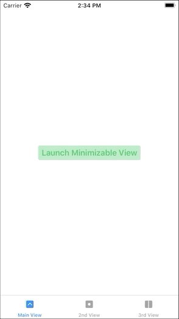

# MinimizableView (iOS 13+ / iPadOS)

[](https://cocoapods.org/pods/MinimizableView)
[](https://cocoapods.org/pods/MinimizableView)
[](https://cocoapods.org/pods/MinimizableView)


 MinimizableView is a simple SwiftUI view for iOS and iPadOS that can minimize like the mini-player in the Spotify or Apple Music app. Currently, it seems that SwiftUI does not support custom modals (with different animations / states than sheet, actionSheet, alert, popover etc.), so this simple view can be considered as a workaround.
It can only be used from iOS 13.0 because SwiftUI is not supported in earlier iOS versions.

**Breaking changes in version 2.0. See details below in the version history**

*Special thanks to Kavsoft ([see here](https://kavsoft.dev/SwiftUI_2.0/Apple_Music/)) - I used parts of their MiniPlayer content in the example. The framework is my own creation though.*

## Example project

This repo only contains the Swift package, no example code. Please download the example project [here](https://github.com/DominikButz/MinimizableViewExample.git).
You need to add the MinimizableView package either through cocoapods or the Swift Package Manager (see below - Installation). 

## Features

* Create your own content, background and compact view. The compact view is optional - in case you set it in the initializer, it will appear in the minimized state. 
* By changing the setting properties of the MinimizableViewHandler, you can customize the following properties:
	- minimizedHeight
    - overrideHeight (in case you want to set a height different from the geometry size height)
	- lateralMargin
    - edgesIgnoringSafeAreas

Check out the examples for details. 


## Installation


Installation through the Swift Package Manager (SPM) or cocoapods is recommended. 

SPM:
Select your project (not the target) and then select the Swift Packages tab. Click + and type MinimizableView - SPM should find the package on github. 

Cocoapods:

platform :ios, '14.0'

target '[project name]' do
 	pod 'MinimizableView'
end


Check out the version history below for the current version.


Make sure to import MinimizableView in every file where you use the MinimizableView or MinimizableViewHandler

```Swift
import MinimizableView
```

## Usage

Check out the following example. This repo only contains the Swift package, no example code. Please download the example project [here](https://github.com/DominikButz/MinimizableViewExample.git).


 


### Code example: Content View (your main view)

Simply attach the .minimizableView modifier to your main view, e.g. a TabView. 
To trigger presentation, dismissal, minimization and expansion, you need to call the respective functions of the minimizableViewHandler: present(), dismiss(), minimize() and expand(). It is advisable to call toggleExpansionState() on the minimizableViewHandler whenever you use a tapGesture to toggle the expansion state. 

 If you don't want a separate compact view, just pass an EmptyView into the compactView closure of the initialiser. The code in the body of MinimizableView checks if compactView is an EmptyView and in that case does not display it.  if there is no compact view, the top of your content will be shown at the bottom of the screen in minimized state.  Use the minimizableViewHandler as EnvironmentObject in your content view - e.g. to remove and insert certain subviews (or to change their opacity) once the minimized property changes (see the example below).

You also need to attach the minimizableViewHandler as environment object to the MinimizableView. 

```Swift

struct RootView: View {

    @ObservedObject var miniHandler: MinimizableViewHandler = MinimizableViewHandler()
    @State var selectedTabIndex: Int = 0
    @GestureState var dragOffset = CGSize.zero
    @Namespace var namespace

    var body: some View {
        GeometryReader { proxy in

                TabView(selection: self.$selectedTabIndex) {
                    
                    Button(action: {
                        print(proxy.safeAreaInsets.bottom)
                        self.miniHandler.present()
                        
                    }) { TranslucentTextButtonView(title: "Launch Minimizable View", foregroundColor: .green, backgroundColor: .green)}.disabled(self.miniHandler.isPresented)
                        
                        .tabItem {
                            Image(systemName: "chevron.up.square.fill")
                            Text("Main View")
                    }.tag(0)
                    
                    Text("More stuff").tabItem {
                        Image(systemName: "dot.square.fill")
                        Text("2nd View")
                    }.tag(1)
                    
                    ListView(availableWidth: proxy.size.width)
                        .tabItem {
                        Image(systemName: "square.split.2x1.fill")
                        Text("List View")
                    }.tag(2)
                    
                    
                }.background(Color(.secondarySystemFill))
                .statusBar(hidden: self.miniHandler.isPresented && self.miniHandler.isMinimized == false)
                .minimizableView(content: {ContentExample(animationNamespaceId: self.namespace)},
                  compactView: {
                    EmptyView()  // replace EmptyView() by CompactViewExample() to see the a different approach for the compact view
                }, backgroundView: {
                    self.backgroundView()},
                    dragOffset: $dragOffset,
                    dragUpdating: { (value, state, transaction) in
                        state = value.translation
                        self.dragUpdated(value: value)
   
                }, dragOnChanged: { (value) in
                        // add some custom logic if needed
                },
                    dragOnEnded: { (value) in
                    self.dragOnEnded(value: value)
                }, geometry: proxy, settings: MiniSettings(minimizedHeight: 80))
                .environmentObject(self.miniHandler)
     
        }
    
        //
    }
    
    
    func backgroundView() -> some View {
        VStack(spacing: 0){
            BlurView(style: .systemChromeMaterial)
            if self.miniHandler.isMinimized {
                Divider()
            }
        }.cornerRadius(self.miniHandler.isMinimized ? 0 : 20)
        .onTapGesture(perform: {
            if self.miniHandler.isMinimized {
                self.miniHandler.expand()
                //alternatively, override the default animation. self.miniHandler.expand(animation: Animation)
            }
        })
    }
    
    
    func dragUpdated(value: DragGesture.Value) {
        
        if self.miniHandler.isMinimized == false && value.translation.height > 0   { // expanded state
            
            self.miniHandler.draggedOffsetY = value.translation.height  // divide by a factor > 1 for more "inertia" if needed
            
        } else if self.miniHandler.isMinimized && value.translation.height < 0   {// minimized state
            self.miniHandler.draggedOffsetY = value.translation.height  // divide by a factor > 1 for more "inertia" if needed
            
        }
    }
    
    func dragOnEnded(value: DragGesture.Value) {
        
        if self.miniHandler.isMinimized == false && value.translation.height > 90  {
            self.miniHandler.minimize()

        } else if self.miniHandler.isMinimized &&  value.translation.height < -60 {
                  self.miniHandler.expand()
        }
       withAnimation(.spring()) {
            self.miniHandler.draggedOffsetY = 0
       }

    }
}


```

## Change log

#### [Version 2.3.3](https://github.com/DominikButz/MinimizableView/releases/tag/2.3.3)
Fixes presentation and dismiss transition bug that would move the background out of the view separately from the content.

#### [Version 2.3.2](https://github.com/DominikButz/MinimizableView/releases/tag/2.3.2)
Added minimumDragDistance to settings. If your content view contains a List, make sure to set this value > 0 (usually between 10 and 30 is a suitable value) - this will make sure the List is scrollable.

#### [Version 2.3.1](https://github.com/DominikButz/MinimizableView/releases/tag/2.3.1)
Bug fix: If the user drags the mini view up or down and simultaneously does a pan gesture (magnifiying gesture), mini view does not freeze any more but minimizes instead. 

#### [Version 2.3](https://github.com/DominikButz/MinimizableView/releases/tag/2.3)
Breaking change: added dragOffset parameter and dragUpdating closure. It is possible to move the dragOnChange logic to the dragUpdating closure (see updated example code).

#### [Version 2.2.1](https://github.com/DominikButz/MinimizableView/releases/tag/2.2.1)
Content view and compact view are now clipped to prevent subviews in the content view from still being visible despite being minimized. This removes the necessity to apply the clipped modifier on your custom content and compact views. Since the subviews of your content view disappear properly now once the mini view compresses, it is not necessary any more to conditionally show and remove subviews of your content view according to minimized and expanded states (exceptions:  subviews with matched geometry effect and removing / showing view elements on the top bar of your content view if you don't use a separate compact view).

#### [Version 2.2](https://github.com/DominikButz/MinimizableView/releases/tag/2.2)
iOS 15 update: Removed animation from settings because the animation modifier on the miniView can impact the content view's subviews' animations and lead to weird behavior. Instead the miniView handler functions present(), expand(),  minimize() and toggleExpansionState() have now (an) animation parameter(s) that can be overridden (default is .spring()).

#### [Version 2.1.1](https://github.com/DominikButz/MinimizableView/releases/tag/2.1.1)
iOS 15 update: fixed a bug that could trigger an infinite loop while dragging the mini view upwards (in minimized state).

#### [Version 2.1](https://github.com/DominikButz/MinimizableView/releases/tag/2.1)
Added edgesIgnoringSafeArea to settings. Default value is [.bottom, .top]. Make sure to add top padding to your content if required. 

#### [Version 2.0.2](https://github.com/DominikButz/MinimizableView/releases/tag/2.0.2)
Bug fix: When in minimized state and the keyboard appears, the miniView will now correctly disappear and reappear after the keyboard is dismissed.

#### [Version 2.0.1](https://github.com/DominikButz/MinimizableView/releases/tag/2.0.1)
Moved minimizedBottomMargin to the miniView initializer. This is useful e.g. in case of a changing distance to the bottom edge according to the screen orientation. 

#### [Version 2.0](https://github.com/DominikButz/MinimizableView/releases/tag/2.0)
Breaking Changes. the following parameters need to be set in the initialiser: 
- backgroundView
- onDragChanged and onDragEnded  
- settings (optional)

#### [Version 1.2.1](https://github.com/DominikButz/MinimizableView/releases/tag/1.2.1)
Bug fix: when in minimized state, the mini view will disappear if the keyboard shows (instead of floating above the keyboard).

#### [Version 1.2](https://github.com/DominikButz/MinimizableView/releases/tag/1.2)
The compactView parameter cannot be nil. If you don't want a separate compactView, pass in an EmptyView. 
Removed transitions from minimizableView body (contentView and compactView). Instead, attach the transition modifier to your implementation of conentView and compactView. Check out the example repository for details.
Parameters of the MiniSettings struct can now be set directly in the initializer.

#### [Version 1.1.1](https://github.com/DominikButz/MinimizableView/releases/tag/1.1.1)
Slight animation improvement.

#### [Version 1.1](https://github.com/DominikButz/MinimizableView/releases/tag/1.1)
Content view now only appears if the mini view is presented. Other minor improvements.

#### [Version 1.0](https://github.com/DominikButz/MinimizableView/releases/tag/1.0)
Breaking change of initializer: Content view and compact view now need to be inserted into closures, no more casting to AnyView! Bug fix: top of mini view does not show any more when in hidden state in case the UI device is without home button (e.g. iPhone 11 max). Bonus: convenience modifier (see example).

#### [Version 0.3.2](https://github.com/DominikButz/MinimizableView/releases/tag/0.3.2)
Bug fixes: onMinimization is now called as expected. onExpansion is only called when isPresented is true. 

#### [Version 0.3.1](https://github.com/DominikButz/MinimizableView/releases/tag/0.3.1)
Adding safety margin to offsetY when minimizable view presentation state is false - this fixes the shadow visibility bug at the bottom of the screen.

#### [Version 0.3](https://github.com/DominikButz/MinimizableView/releases/tag/0.3)
Expansion / minimization through the VerticalDragGesture modifier is now triggered only after the drag gesture ended. The VerticalDragGesture view modifier is now internal to the framework - instead *use the modifier function verticalDragGesture(translationHeightTriggerValue: CGFloat)*. Bug fixes. 

#### [Version 0.2.1](https://github.com/DominikButz/MinimizableView/releases/tag/0.2.1)
Updated frame height and offsetY functions to allow expanding the minimized frame when dragging upwards.

#### [Version 0.2](https://github.com/DominikButz/MinimizableView/releases/tag/0.2)
Initial public release. 


## Author

dominikbutz@gmail.com

## License

MinimizableView is available under the MIT license. See the LICENSE file for more info.


